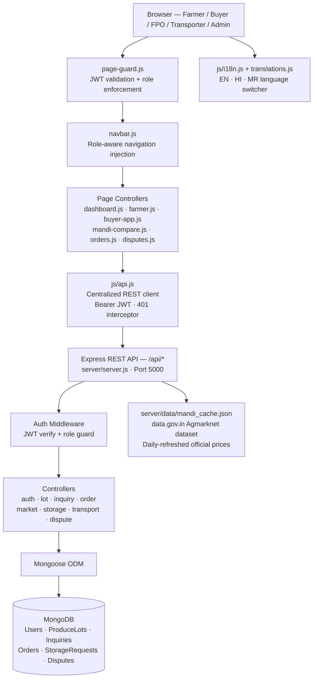

<div align="center">

# KrishiShetra — कृषि क्षेत्र

**"Which mandi pays more?" → "Which mandi actually gives me more?"**

*A full-stack AgriTech platform giving Indian farmers transparent market intelligence, direct buyer access, and real price discovery — without middlemen.*

[](https://nodejs.org/)
[](https://expressjs.com/)
[](https://www.mongodb.com/)
[](#multilingual-support)
[](LICENSE)

[Problem](#the-problem) · [Solution](#our-solution) · [Features](#key-features) · [Architecture](#system-architecture) · [Setup](#getting-started) · [Demo](#demo)

</div>

---

## The Problem

Indian smallholder farmers — who produce over 50% of the country's food — sell most of their harvest to local intermediaries at prices well below what distant mandis or institutional buyers would pay. The core barriers are:

- **No price transparency** — farmers cannot compare real prices across mandis
- **Transport cost blindness** — a higher mandi price can mean lower net income after freight
- **No direct buyer access** — institutional buyers, food processors, and FPOs operate in a separate information world
- **Paper-based disputes and no payment protection** — once produce leaves the farm, the farmer has little recourse

The farmer's real question is never "which mandi is cheapest?" — it is **"which mandi actually puts more money in my pocket after transport?"**

---

## Our Solution

**KrishiShetra** is a role-based platform built for the full agricultural trade chain: farmers, institutional buyers, FPOs (Farmer Producer Organizations), transporters, and platform administrators.

It provides:
- **Net margin price comparison** across 45+ APMC mandis — factoring in freight cost, not just modal price
- **Direct lot-to-buyer marketplace** — farmers list standardized produce lots that verified buyers can discover and bid on
- **Transparent multi-turn negotiation** — complete offer/counter-offer timeline with audit trail
- **6-stage order lifecycle** from deal acceptance to delivery
- **Multilingual UI** in English, Hindi, and Marathi so farmers can use the platform in their own language

The platform uses a **demo data fallback system** for local/offline demonstration and connects to live government mandi data (data.gov.in) and a MongoDB backend in production.

---

## Key Features

### Farmer Portal
- Create and publish standardized produce lots (`KS-YYYY-XXXXXX`) with grade, quantity, harvest date, and farm geolocation
- View live and cached mandi prices across 45+ APMCs from the government data.gov.in dataset
- Receive, accept, reject, or counter buyer purchase inquiries in real time
- Track orders through a 6-stage fulfillment pipeline
- Raise and manage trade disputes with FPO mediation support
- Store produce with warehouse facilities and apply for pledge financing (Kisan Credit integration path)

### Mandi Price Intelligence
- **Net margin arbitrage engine** — compares `modal price − estimated freight cost per quintal` across all available mandis for a selected crop
- Automatically highlights the highest net-realization destination
- Backed by the official [Agmarknet dataset](https://data.gov.in) refreshed daily

### Buyer Command Center
- Browse produce marketplace filtered by crop type, quality grade, organic status, region, and price range
- Submit purchase inquiries with target price and required quantity
- Multi-turn negotiation with timestamped offer history until mutual agreement
- One-click order creation from accepted deal

### FPO Collective Hub
- Pool harvests from member farmers into commercial-scale bulk lots
- Member farmer directory with acreage and seasonal yield tracking
- Unified dispute mediation and order oversight

### Transporter Logistics Portal
- Discover available agricultural freight loads
- Accept trips, manage driver assignments, and track delivery milestones
- Earnings analytics per completed delivery

### Admin Governance Suite
- Platform-wide GMV, user counts, and active lot metrics
- KYC verification queue for buyers and transporters
- System health diagnostics

### Multilingual Support
Full UI in **English, Hindi (हिंदी), and Marathi (मराठी)** — every page, navigation element, status label, and form. Built on a custom i18n system (`js/translations.js` + `js/i18n.js`) — no third-party i18n library needed.

---

## User Roles & Journeys

| Role | Entry Point | Core Journey |
|---|---|---|
| **Farmer** | `dashboard.html` | Register farm → Create lot → Receive buyer inquiry → Negotiate → Fulfill order |
| **Institutional Buyer** | `buyer.html` | Browse marketplace → Submit offer → Negotiate → Confirm order |
| **FPO** | `fpo-dashboard.html` | Aggregate member lots → List bulk supply → Mediate disputes |
| **Transporter** | `transporter/dashboard.html` | Discover freight loads → Accept trip → Deliver → Log earnings |
| **Admin** | `admin/` | Verify users → Monitor platform health → Review disputes |

---

## System Architecture



---

## Project Structure

```
KrishiShetra/
├── index.html                    # Landing page
├── dashboard.html                # Farmer dashboard
├── lots.html                     # Produce lot management
├── buyers.html                   # Buyer inquiry inbox (farmer view)
├── market.html                   # Public produce marketplace
├── mandi-compare.html            # Mandi price arbitrage engine
├── ai-forecast.html              # Price forecast & harvest timing
├── orders.html                   # Order tracking (6-stage stepper)
├── storage.html                  # Storage & pledge financing
├── disputes.html                 # Dispute & mediation center
├── fpo-dashboard.html            # FPO collective portal
├── buyer.html                    # Buyer marketplace & command center
├── login.html / register.html    # Multi-role auth pages
│
├── css/
│   ├── style.css                 # Landing page & shared design tokens
│   ├── dashboard.css             # Shared farmer header & dashboard styles
│   └── [page].css                # Per-page component styles
│
├── js/
│   ├── api.js                    # Unified API client (Bearer JWT, error handling)
│   ├── auth.js                   # Client auth state manager
│   ├── i18n.js                   # Language switcher & DOM translation
│   ├── translations.js           # All UI strings in EN / HI / MR
│   ├── navbar.js                 # Role-aware navigation injector
│   ├── page-guard.js             # Client-side route authentication
│   ├── farmer.js                 # Lot management controller
│   ├── dashboard.js              # Farmer dashboard controller
│   ├── mandi-compare.js          # Price arbitrage & net margin calculator
│   ├── mandi-map.js              # Leaflet APMC mandi map engine
│   ├── orders.js                 # 6-stage order lifecycle
│   ├── disputes.js               # Dispute & mediation UI
│   ├── storage.js                # Storage booking & pledge UI
│   └── grading-engine.js         # Produce quality grading logic
│
├── server/
│   ├── server.js                 # Express entry point, CORS, middleware
│   ├── config/db.js              # MongoDB / Mongoose connection
│   ├── models/                   # Mongoose schemas
│   │   ├── User.js · FarmerProfile.js · BuyerProfile.js
│   │   ├── ProduceLot.js · Inquiry.js · Offer.js · Order.js
│   │   ├── StorageFacility.js · StorageRequest.js · PledgeFinancingRequest.js
│   │   ├── Dispute.js · Notification.js · TransportProfile.js
│   │   └── ActivityLog.js · KYC.js · Payment.js · SavedLot.js
│   ├── controllers/              # Business logic (one file per domain)
│   ├── routes/                   # Express route registrations
│   ├── middleware/               # JWT verify, role guard, error handler
│   ├── services/                 # Brevo email delivery service
│   └── data/mandi_cache.json     # Cached Agmarknet mandi prices
│
├── admin/                        # Admin governance suite
├── transporter/                  # Transporter logistics portal
├── assets/                       # Crop imagery & background photos
├── .env.example                  # Environment variable template
└── package.json                  # Node.js dependencies & scripts
```

---

## API Reference

All routes are prefixed `/api`. Protected routes require `Authorization: Bearer <token>`.

| Domain | Key Endpoints |
|---|---|
| **Auth** | `POST /api/auth/register` · `POST /api/auth/login` · `GET /api/auth/me` |
| **Farmer** | `GET/POST/PUT /api/farmer/profile` |
| **Lots** | `POST /api/lots` · `GET /api/lots/my` · `PUT /api/lots/:id` · `PUT /api/lots/:id/cancel` |
| **Market** | `GET /api/market/lots` · `GET /api/market/lots/:id` |
| **Inquiries** | `POST /api/inquiries` · `PUT /api/inquiries/:id/offer` · `PUT /api/inquiries/:id` |
| **Orders** | `POST /api/orders` · `PUT /api/orders/:id/status` · `PUT /api/orders/:id/cancel` |
| **Storage** | `GET /api/storage` · `POST /api/storage/requests` · `GET /api/storage/my-requests` |
| **Disputes** | `POST /api/disputes` · `GET /api/disputes/my` · `PUT /api/disputes/:id` |
| **Transport** | `GET /api/transport/loads` · `POST /api/transport/trips` · `PUT /api/transport/trips/:id` |

---

## Getting Started

### Prerequisites

- [Node.js](https://nodejs.org/) v18+
- [MongoDB](https://www.mongodb.com/) — local or [MongoDB Atlas](https://www.mongodb.com/atlas) free tier
- Git

### 1. Clone

```bash
git clone https://github.com/SurajMahto006/KrishiShetra.git
cd KrishiShetra
```

### 2. Install dependencies

```bash
npm install
```

### 3. Configure environment

```bash
cp .env.example .env
```

Edit `.env` with your values:

```env
PORT=5000
MONGODB_URI=mongodb://localhost:27017/krishishetra   # or your Atlas URI
JWT_SECRET=your_random_secret_key
JWT_EXPIRES_IN=7d

# Optional — transactional email via Brevo
BREVO_API_KEY=your_brevo_api_key
EMAIL_FROM=notifications@krishishetra.com

# Optional — live mandi data refresh from data.gov.in
DATA_GOV_API_KEY=your_data_gov_in_api_key

# CORS allowed origins
FRONTEND_URL=http://localhost:5000
```

> The platform includes a **demo data fallback** — if the backend is unavailable, pages display realistic sample data automatically. You do not need a running database to explore the UI.

### 4. Start

```bash
# Development (nodemon auto-reload)
npm run dev

# Production
npm start
```

### 5. Open in browser

| Page | URL |
|---|---|
| Landing | http://localhost:5000 |
| Farmer Dashboard | http://localhost:5000/dashboard.html |
| Mandi Comparison | http://localhost:5000/mandi-compare.html |
| Buyer Marketplace | http://localhost:5000/buyer.html |
| Transporter Portal | http://localhost:5000/transporter/dashboard.html |
| FPO Hub | http://localhost:5000/fpo-dashboard.html |
| Admin Suite | http://localhost:5000/admin/ |

---

## Environment Variables

| Variable | Required | Description |
|---|---|---|
| `PORT` | No (default 5000) | Express server port |
| `MONGODB_URI` | **Yes** | MongoDB connection string |
| `JWT_SECRET` | **Yes** | Secret for signing JWTs |
| `JWT_EXPIRES_IN` | No (default `1d`) | Token lifespan |
| `BREVO_API_KEY` | No | Transactional email (Brevo/Sendinblue) |
| `EMAIL_FROM` | No | Verified sender address |
| `DATA_GOV_API_KEY` | No | data.gov.in API key for live mandi price refresh |
| `FRONTEND_URL` | No | Comma-separated CORS allowed origins |

---

## Demo

A live deployment is available on Render. The demo mode uses pre-seeded data — no account required to explore the UI.

> **Note:** The backend on Render may spin down after inactivity. If the first page load is slow, wait ~30 seconds for the service to wake.

---

## Technology Stack

| Layer | Technology |
|---|---|
| Frontend | Vanilla HTML · CSS · JavaScript (no framework) |
| Styling | Custom CSS with design tokens (`--ks-evergreen`, `--ks-sage`, etc.) |
| Icons | [Lucide](https://lucide.dev/) (CDN) |
| Maps | [Leaflet.js](https://leafletjs.com/) — APMC mandi geospatial map |
| Charts | [Chart.js](https://www.chartjs.org/) — price trend visualizations |
| i18n | Custom system — `js/translations.js` + `js/i18n.js` |
| Backend | [Node.js](https://nodejs.org/) + [Express](https://expressjs.com/) |
| Database | [MongoDB](https://www.mongodb.com/) via [Mongoose](https://mongoosejs.com/) |
| Auth | JWT (`jsonwebtoken`) + `bcryptjs` password hashing |
| Email | [Brevo](https://brevo.com/) transactional email API |
| Mandi Data | [data.gov.in](https://data.gov.in/) Agmarknet official dataset |
| Hosting | [Render](https://render.com/) |

---

## What Is and Is Not Implemented

### Implemented
- Multi-role authentication (JWT, bcrypt, role guards)
- Farmer produce lot lifecycle (create, list, edit, cancel)
- Buyer marketplace with filter and search
- Multi-turn inquiry and negotiation with offer timeline
- 6-stage order tracking with status progression
- Mandi price comparison with freight-adjusted net margin
- Storage booking and pledge financing request flow
- Dispute and mediation center with FPO involvement
- Transporter freight load discovery and trip tracking
- FPO member management and bulk lot aggregation
- Admin KYC, platform metrics, and system health
- Full multilingual UI — English, Hindi, Marathi
- Official mandi data cache from data.gov.in (daily refresh)
- Demo data fallback for offline/no-backend exploration

### Future Scope
- Live GPS truck tracking for in-transit orders
- UPI / payment gateway integration for in-platform escrow release
- Voice assistant for mandi queries in Hindi and regional languages
- Automated warehouse receipt tokenization (pledge financing backend)
- Mobile app (React Native) for field-level offline lot creation

---

## Project Context

KrishiShetra was built as a hackathon submission addressing the real, documented challenge of agricultural price discovery and market access for Indian smallholder farmers. Every feature represents an actual implementation decision — the mandi arbitrage engine, the negotiation protocol, the multilingual support, and the role-based architecture were all chosen to reflect how agricultural trade actually works in India, not as abstract feature lists.

The platform is designed to be deployable on a free-tier cloud stack (MongoDB Atlas + Render) and operable without an internet connection using the demo data fallback.

---

## Team

| Name | Role |
|---|---|
| Suraj Mahto | Full-stack development, system architecture, backend API |

---

## License

MIT — see [LICENSE](LICENSE) for details.

---

<div align="center">
  <sub>Built for Indian farmers and the agricultural community.</sub>
</div>
